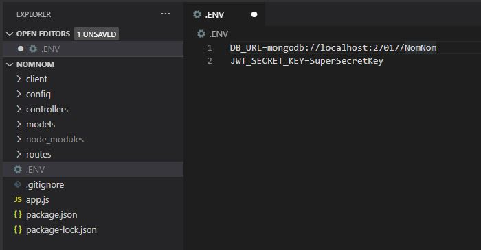
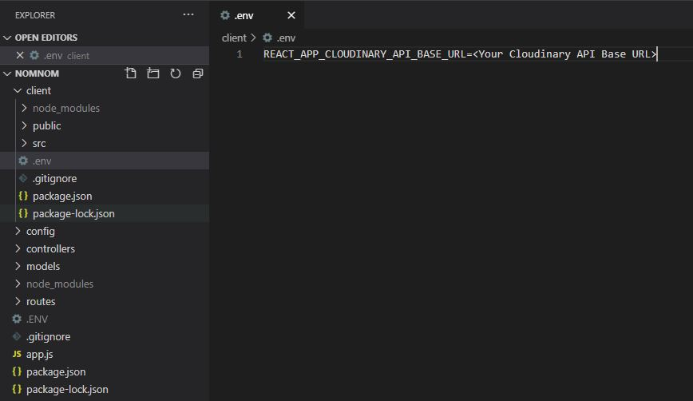
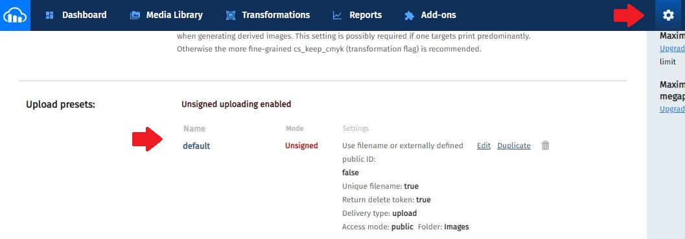

# NomNom

## Table of contents
* [General info](#general-info)
* [Technologies](#technologies)
* [Setup](#setup)

## General info
NomNom is a simple food blog where people can browse for recipes and articles about healthier living.

### Unregistered users
Unregistered users can browse through all of the published content.

### Registered users
Registered users have two different roles: "user" and "admin".

Users can browse through all the published content. In addition they can leave and reply to comments for different recipes and articles. 
They can also mark recipes as favourites if they like them. Users can add a profile picture and input their names in the profile section.

*By default new registered users are created with a "user" role.


Admins can create content for others to view and like. They can publish recipes, articles and create reusable 
ingredients and measurement units for future recipes they create.

*Admin status cannot be set through the application. It needs to be modified in the users collection of the database under the "role" property.
	
## Technologies
Project is created with:
* NodeJS v12.16.3
* Express v4.17.1
* Mongoose v5.9.19
* React v16.13.1
	
## Setup
Backend server configuration:

In the main folder you have to create a .ENV file and add values for the DB_URL(Local or cloud Mongo database) and JWT_SECRET_KEY(Random string) variables like so:


In the client folder you have to create a .env file and add a value for the Cloudinary API for the project like so:


To get an API endpoint you have to register on https://cloudinary.com and follow the instructions. After you have a repository you can 
find the API endpoint of your project in the dashboard under the Account details - API Base URL. The last thing you need to do is ensure you have a unsigned upload preset
called "default" in your Cloudinary configuration:


Running the project:

```
$ cd into the main folder
$ npm install - will install dependencies
$ npm run start - will start the backend server
$ npm run client - will start the React development server
$ npm run dev - will start both from the same terminal
$ npm run test:snapshot - will run snapshot tests for the client application*
$ npm run test:e2e - will run Cypress and allow for selection of test cases
```
*Since the project uses Styled Components these tests fail on the auto generated css classes. I haven`t found a way around this.
